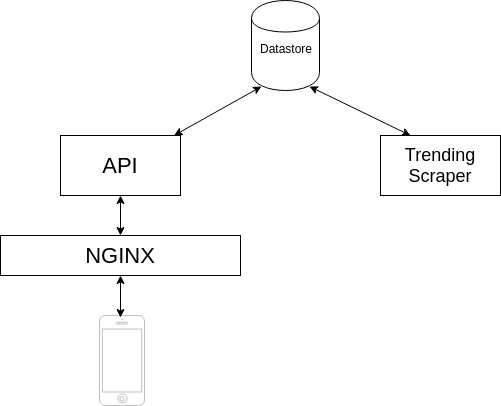

# GitPoint API Documentation

### This document is WIP.
These are the first thoughts, a more indpeth explanation per component / working will be added asap. 

A task list can be found [here](tasks.md).

## Introduction
**Note: ** These are the first thoughts, a more indpeth explanation per component / working will be added asap. 

This document describes a proposal for a GitPoint API. This API will be used by the [GitPoint app](https://github.com/gitpoint/git-point). 
The first feature of this API will be a way to retrieve a list of the currently [trending repositories on github](https://github.com/trending) since the Github API does not provide a api this.

## Overview
The following diagram shows a overview of the several components it will include.

### Nginx
The API will be exposed behind a nginx layer which will reverse proxy the requests to the API. This approach makes it easy to later on add more API's or switch versions. We could also use it for some simple round-robin load balancing. 

### API
The actual API which will retrieve and handle the requests coming in from the phone. 
The API documentation can also be found in this document. 

### Datastore
We need to save the data in some database. I haven't made a descision yet if we go for a relational database or for a NoSQL database. Although i think a NoSQL will be perfect for our needs. 

### [Trending Scraper](https://github.com/RolfKoenders/gitpoint-api-trending-scraper)
This is a worker which will scrape github based on a cronjob pattern. The data it scrapes will be formatted to our model and stored in the datastore. 

## Deployment
*This section needs to be extended*.
Since its not just one component we have to deploy a nice solution will be to deploy it on a Kubernetes cluster. I haven't check if it will fit on a free tier or not. Otherwise we could search for other options. 

## API Documentation 
API documentation.

### Trending API
*TODO*

## Contribute
Don't hesitate to open an issue if you have a question or an idea. You can also find me in the [Gitter of GitPoint](https://gitter.im/git-point/)
